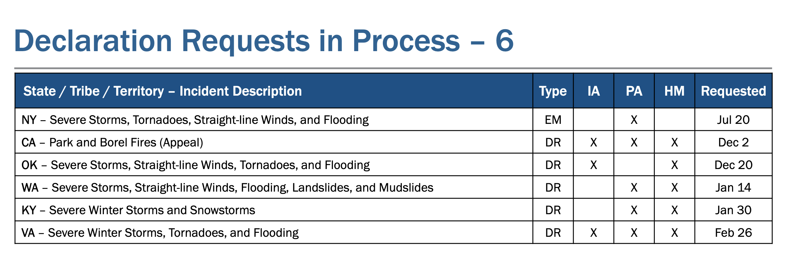
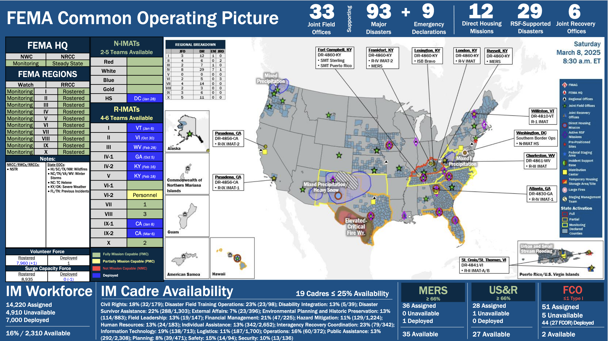
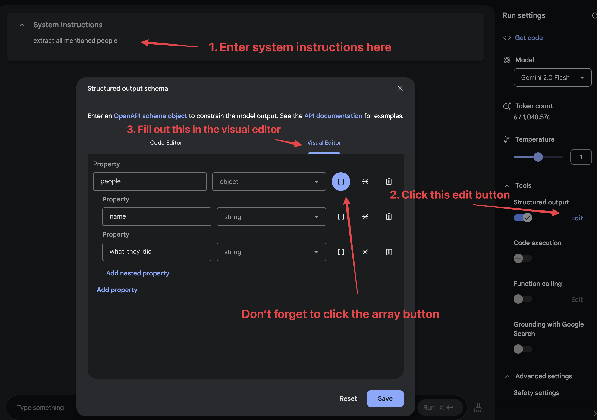

# Cutting-edge web scraping techniques

This one hour workshop was presented at the [NICAR 2025](https://www.ire.org/training/conferences/nicar-2025/) data journalism conference on Saturday March 8th 2025 at 11:30am.

> ### Original abstract
>
> Interested in new and effective advanced web scraping techniques? Join this session to learn about:
>
> - Video scraping: a new technique where you take a screen capture video and feed it into Google's Gemini models to turn it into structured data.
> - Using image models such as Gemini, GPT-4o and Claude 3.7 Sonnet are also extremely effective. It's possible to extract structured data from images, or poorly structured PDF files
> - Other modern scraping techniques using libraries like Playwright - a modern alternative to Selenium - for browser automation. Browser automation becomes a lot less complicated if you combine it with video or image analysis models.
>
> This session is good for: journalists with some web scraping experience. Attendees will need to bring their own laptop (no tablets).

## Pre-requisites

You will need:

- A **GitHub account** for GitHub Actions and GitHub Codespaces.
- A **Python environment** - I recommend GitHub Codespaces for this, but you can run things on your own laptop if you like.
- A **Google account** for access to [Google AI Studio](https://aistudio.google.com/). You may find that your work Google account is unable to access that tool, in which case you can try a personal account instead.

## Structure of this session

This is an interactive, hands-on workshop. We'll be working through four exercises:

1. Building a [Git scraper](https://simonwillison.net/2020/Oct/9/git-scraping/) - an automated scraper in GitHub Actions that records changes to a resource over time
2. Using in-browser JavaScript and then [shot-scraper](https://shot-scraper.datasette.io/) to extract useful information
3. Using [LLM](https://llm.datasette.io/) with both OpenAI and Google Gemini to extract structured data from unstructured websites
4. [Video scraping](https://simonwillison.net/2024/Oct/17/video-scraping/) using [Google AI Studio](https://aistudio.google.com/)

## 1. Git scraping

A **git scraper** is a GitHub repository configured to use GitHub Actions to scrape websites or other online resources and record changes to them over time.

Here are [437 examples](https://github.com/topics/git-scraping?o=desc&s=updated) of this category of repo, ordered by most recently scraped! I have a whole lot more notes about [git-scraping on my blog](https://simonwillison.net/tags/git-scraping/).

To create a basic one, first sign into GitHub and then visit this repository:

https://github.com/simonw/git-scraper-template

This is a **template repository** - you can select "Use this template" and then "Create a new repository" to start your own based on the template.

Enter the URL of the website - or direct URL to a JSON file - in the **description** field when you create the repository. It will be configured to track changes to that page once per day, or any time you manually activate the scraper.

Try with this from https://earthquake.usgs.gov/earthquakes/feed/v1.0/geojson.php

    https://earthquake.usgs.gov/earthquakes/feed/v1.0/summary/all_hour.geojson

To avoid wasted resources, you should deactivate your scraper at the end of this workshop. You can do that by adding a `#` in front of this line in your `.github/workflows/scrape.yml` file:

    - cron: '23 6 * * *'


**Bonus**: if you want notifications every time something changes, every GitHub repository includes a hidden RSS feed. Add `.atom` to the commits page URL, for example:

    https://github.com/simonw/scrape-openai-models/commits/main.atom

I subscribe to these in [NetNewsWire](https://netnewswire.com).

## 2. Scraping with in-browser JavaScript

Websites are complicated beasts these days. Scraping just through parsing HTML often doesn't work - we need to load up the entire website in a real browser first.

Some websites are resistant to scraping techniques. We're journalists, we have legitimate reasons to need that data!

Using **JavaScript** can solve both of these problems. We can extract any data that's visible on the page, and we can bypass all known forms of anti-scraping technology if we start by doing it in our own browsers.

Here's a version of a function I use all the time:

```javascript
function tableToObjects(table) {
  const rows = Array.from(table.querySelectorAll("tr"));
  if (rows.length === 0) {
    return [];
  }
  const headers = Array.from(rows[0].querySelectorAll("th"))
    .map(headerCell => headerCell.textContent.trim());
  if (headers.length === 0) {
    return [];
  }
  const result = [];
  for (let i = 1; i < rows.length; i++) {
    const row = rows[i];
    const cells = Array.from(row.querySelectorAll("td"));
    if (cells.length === 0) {
      continue;
    }
    const rowObject = {};
    headers.forEach((header, index) => {
      if (index < cells.length) {
        rowObject[header] = cells[index].textContent.trim();
      }
    });
    result.push(rowObject);
  }
  return result;
}
```
Navigate to https://doge.gov/spend and open the browser DevTools and paste that it.

Now run this:
```javascript
copy(tableToObjects(document.querySelectorAll("table")[0]))
```
Paste the result into a text editor. You should get JSON data extracted from the table.

### Using this for infinite scrolling web pages

I wrote about this trick in [Collecting replies to tweets using JavaScript](https://til.simonwillison.net/twitter/collecting-replies). I'll demonstrate the pattern, and if you have a Twitter account you can try it yourself.

Visit a tweet with a lot of replies, then run the following in your browser DevTools:

```javascript
window.tweets = window.tweets || [];
let seenHrefs = new Set();

function extractNumber(el, selector) {
  const element = el.querySelector(selector);
  if (element && element.getAttribute) {
    const match = element.getAttribute("aria-label").match(/(\d+)/);
    return match ? parseInt(match[0], 10) : 0;
  }
  return 0;
}

function collectTweets() {
  // Ditch any <span>…</span> elements
  document.querySelectorAll("span").forEach((span) => span.textContent.trim() === "…" && span.remove());
  Array.from(document.querySelectorAll("[data-testid=tweet]"), (el) => {
    const datetime = el.querySelector("time")?.dateTime || "";
    const username = el.querySelector('[data-testid="User-Name"] a')?.href.split("/").slice(-1)[0] || "";
    const tweet = el.querySelector('[data-testid="tweetText"]')?.innerText || "";
    const href = el.querySelector("time")?.closest("a")?.href || "";
    const likes = extractNumber(el, '[data-testid="like"]');
    const impressions = extractNumber(el, '[aria-label*="View post analytics"]');
    const retweets = extractNumber(el, '[aria-label*="Repost"]');
    return { datetime, username, tweet, href, likes, impressions, retweets };
  }).forEach((tweetObj) => {
    // Filter out tweets with previously seen hrefs and add new ones to window.tweets
    if (!seenHrefs.has(tweetObj.href)) {
      seenHrefs.add(tweetObj.href);
      window.tweets.push(tweetObj);
    }
  });
}

setInterval(collectTweets, 500);
```

Scroll down until you have viewed all of the replies, then run this:
```javascript
copy(tweets);
```
Paste into a text editor to see the data you have collected.

### Automating one of these with shot-scraper

If you're going to use GitHub Codespaces for this, click "Use this template" and then "Open in codespace" on this repository. Wait for that to boot up and you should have a terminal where you can start running these commands.

First, install `shot-scraper`:

```bash
pip install shot-scraper
shot-scraper install
```
You can use **shot-scraper** to capture entire screenshots of web pages, which can be useful for archiving projects:

```bash
shot-scraper https://doge.gov/
```
This will produce a VERY long PNG image. You can get a shorter one (and use JPEG instead, which is smaller) like this:
```bash
shot-scraper https://doge.gov/ -o doge.jpg -h 1024
```
The [shot-scraper javascript](https://shot-scraper.datasette.io/en/stable/javascript.html) command is more interesting. It can execute JavaScript against the page and return the results. Here's a simple example:
```bash
shot-scraper javascript doge.gov document.title
```

> `"Work | DOGE: Department of Government Efficiency"`

A more complex one ([thanks, Claude](https://claude.ai/share/58b8c5da-1514-426d-a836-a1d538f3a048)) to return their "estimated savings":
```bash
shot-scraper javascript doge.gov/savings "Array.from(
  document.querySelectorAll('p')
).find(
  p => p.innerText.includes('Estimated Savings')
).nextElementSibling.innerText;"
```
I got:
> `"$105B"`

You can add `-r` (for `--raw`) to get back that string without it being wrapped in quotes.

Now let's use our example from earlier:

```bash
shot-scraper javascript doge.gov/spend '
() => {
  function tableToObjects(table) {
    const rows = Array.from(table.querySelectorAll("tr"));
    if (rows.length === 0) {
      return [];
    }
    const headers = Array.from(rows[0].querySelectorAll("th"))
      .map(headerCell => headerCell.textContent.trim());
    if (headers.length === 0) {
      return [];
    }
    const result = [];
    for (let i = 1; i < rows.length; i++) {
      const row = rows[i];
      const cells = Array.from(row.querySelectorAll("td"));
      if (cells.length === 0) {
        continue;
      }
      const rowObject = {};
      headers.forEach((header, index) => {
        if (index < cells.length) {
          rowObject[header] = cells[index].textContent.trim();
        }
      });
      result.push(rowObject);
    }
    return result;
  }
  return tableToObjects(document.querySelectorAll("table")[0]);
}
'
```
Here's [the JSON I got from that](https://gist.github.com/simonw/734d683dd64f4ba535007a9e925eea51).

You can combine `shot-scraper javascript` with Git scraping. I do that in my [simonw/scrape-hacker-news-by-domain](https://github.com/simonw/scrape-hacker-news-by-domain) repository, which I wrote about in detail in [Scraping web pages from the command line with shot-scraper](https://simonwillison.net/2022/Mar/14/scraping-web-pages-shot-scraper/).

I also wrote up a trick for working around scraping prevention services that exclude GitHub Actions by proxying traffic through an Apple TV on a home network, see [Using a Tailscale exit node with GitHub Actions](https://til.simonwillison.net/tailscale/tailscale-github-actions).

## 3. Structured data extraction using LLM

Here's [documentation on schemas in LLM](https://llm.datasette.io/en/stable/schemas.html).

You'll need API keys for this. Visit [this page](https://tools.simonwillison.net/encrypt#6s444Mi4bEHi9dkcaWxk3ux3EplN9jZyqGpT8MaBcRu7A0FjyxSaAHEyxH4CsMcY25d8qpB2u2XZ687VA41OgfjIdD5HXYKxiTrlJZbdkVM7JiObFnijGFtkYbJMscV4i7qKyLAcO9eHvfe9m+G6fQatlPYLQxPsKqo6GPe+pLHGWx2TZGtZVMtZtr1onaVf2ji3rfRj2yICkGhobv5WXM2rv3Eqr4T163AJ1nv4L3NdGHR6wiI4G+hbtmKvbWimTq5wtns4Cjs9dT1NzchZdLG0UKpGjGqJMUZ4LVcdhNuPSMx3SNWOa7ALd83nv04DUpMPZRYcYRnhQ4d1OphEHiLeqzgsBPuFbZco1TR+kalaqOI05hJh) and enter the passphrase distributed during the workshop to get OpenAI and Gemini keys that you can use during the workshop.

After the workshop you'll need your own. You can get [OpenAI keys here]() (you'll likely have to setup billing, but the cost is extremely low) and [Google Gemini keys here](https://aistudio.google.com/apikey) (they have a generous free tier and extremely inexpensive prices beyond that).

Start in Codespaces (or your local Python environment). Run this:

```bash
pip install llm
llm keys set openai
# Paste your OpenAI key here

llm 'five neat facts about pelicans'
```
Now let's try a schema. Let's invent some dogs:
```bash
llm 'invent some cool dogs' --schema-multi 'name,age int,bio'
```
If you have `jq` installed you can pretty-print the most recent logged data like this:
```bash
llm logs --data -c | jq
```
Where schemas get _useful_ is when we used them to extract data from unstructured pages.

Let's try a version of that now:
```bash
curl 'https://www.whitehouse.gov/presidential-actions/' | \
  llm --schema-multi 'title,url,date:yyyy-mm-dd' 'extract executive actions'
```
Web pages can get large with a lot of tokens. Let's check how many we used:
```bash
llm logs --short --usage
```
I got back this:
```
- model: gpt-4o-mini
  datetime: '2025-03-08T16:05:05'
  conversation: 01jnv81yhk4e0npgjksrh555j6
  prompt: <!DOCTYPE html> <html lang="en-US"> <head> <meta charset="UTF-8" /> <meta
    name="viewport" content="width=device-width...
  usage:
    input: 60822
    output: 647
```
Using [this pricing calculator](https://tools.simonwillison.net/llm-prices) we can see that for GPT-4o mini with 60,822 input tokens and 647 output tokens the cost is 0.9511 cents.

That's one of the cheapest models though, this could cost a _lot_ more with some of the others. GPT-4.5 would charge $4.65 for the same thing!

You can estimate the number of tokens before attempting a prompt using [ttok](https://github.com/simonw/ttok):
```bash
pip install ttok
curl 'https://www.whitehouse.gov/presidential-actions/' | ttok
```
Let's try the same thing again using Google's cheaper models, Gemini 2.0 Flash:
```bash
llm install llm-gemini
llm keys set gemini
# Paste key here

curl 'https://www.whitehouse.gov/presidential-actions/' | \
  llm --schema-multi 'title,url,date:yyyy-mm-dd' 'extract executive actions' -m gemini-2.0-flash
```
That cost just 0.6341 cents!

I tried it against their even cheaper model, `gemini-1.5-flash-8b-latest`, but that one failed to return any results. It's good practice to try different models and figure out the cheapest one that works for your particular problem.

For this particular website the `shot-scraper` technique shown earlier is a better bet - it's much more reliable than LLMs.

Where LLM scraping gets _really_ interesting is on harder content, such as PDFs.

The **FEMA Daily Operations Briefing** is an _incredible_ document, sent out by email to subscribers once a day.

[data-liberation-project/fema-daily-ops-email-to-rss](https://github.com/data-liberation-project/fema-daily-ops-email-to-rss) is an excellent project that tracks those daily releases so you don't have to subscribe to their list.

The PDF briefing for March 8th 2025 [can be found here](https://content.govdelivery.com/attachments/USDHSFEMA/2025/03/08/file_attachments/3187534/FEMA%20Daily%20Ops%20Briefing%2003-08-2025.pdf) (here's [a backup copy](https://static.simonwillison.net/static/2025/FEMA%20Daily%20Ops%20Briefing%2003-08-2025.pdf)).

Page 10 is a good target for extracting structured data:



We'll feed the whole PDF file to Gemini 2.0 Pro (Experimental) with a schema:

```bash
llm 'extract declaration requests' \
  -a 'https://content.govdelivery.com/attachments/USDHSFEMA/2025/03/08/file_attachments/3187534/FEMA%20Daily%20Ops%20Briefing%2003-08-2025.pdf' \
  --schema-multi 'state_tribe_territory,incident_description,type,IA bool,PA bool,HM bool,Requested:YYYY-MM-DD guess year based on it being March 2025 now' \
  -m gemini-2.0-pro-exp-02-05
```
Here's what I got:
```json
 {"items": [
    {
      "HM": false,
      "IA": true,
      "PA": true,
      "Requested": "2024-07-20",
      "incident_description": "Severe Storms, Tornadoes, Straight-line Winds, and Flooding",
      "state_tribe_territory": "NY",
      "type": "EM"
    },
    {
      "HM": true,
      "IA": true,
      "PA": true,
      "Requested": "2024-12-02",
      "incident_description": "Park and Borel Fires (Appeal)",
      "state_tribe_territory": "CA",
      "type": "DR"
    },
    {
      "HM": true,
      "IA": true,
      "PA": true,
      "Requested": "2024-12-20",
      "incident_description": "Severe Storms, Straight-line Winds, Tornadoes, and Flooding",
      "state_tribe_territory": "OK",
      "type": "DR"
    },
    {
      "HM": true,
      "IA": false,
      "PA": true,
      "Requested": "2025-01-14",
      "incident_description": "Severe Storms, Straight-line Winds, Flooding, Landslides, and Mudslides",
      "state_tribe_territory": "WA",
      "type": "DR"
    },
    {
      "HM": true,
      "IA": true,
      "PA": true,
      "Requested": "2025-01-30",
      "incident_description": "Severe Winter Storms and Snowstorms",
      "state_tribe_territory": "KY",
      "type": "DR"
    },
    {
      "HM": true,
      "IA": true,
      "PA": true,
      "Requested": "2025-02-26",
      "incident_description": "Severe Winter Storms, Tornadoes, and Flooding",
      "state_tribe_territory": "VA",
      "type": "DR"
    }
  ]
}
```

This Gemini 2.0 Pro model is currently free, but has strict rate limits. Try some of the other models to see how well they do - `gemini-2.0-flash` and `gemini-2.0-flash-lite` for example.

OpenAI model can't yet handle PDFs but they work very well with images. You can run that screenshot I saved of the PDF through GPT-4o mini like this:

```bash
llm 'extract declaration requests' \
  -a 'https://raw.githubusercontent.com/simonw/nicar-2025-scraping/refs/heads/main/fema-page-10.png' \
  --schema-multi 'state_tribe_territory,incident_description,type,IA bool,PA bool,HM bool,Requested:YYYY-MM-DD guess year based on it being March 2025 now' \
  -m gpt-4o-mini
```
You can use the filepath directly rather than a URL, if you have the file saved locally.

For a really fun challenge, see if you can get useful structured data out of the extremely complicated map on page 8!



## 4. Video scraping using Google AI Studio

Let's finish with a new technique that I think is really promising: **video scraping**.

This is the ultimate hack for scraping data from a website that really, really doesn't want to be scraped.

The Gemini models can accept video as input. The trick is simple: record a video of your screen, browse through a website clicking on different links and pausing for a few seconds each time, then get Gemini to turn that video into JSON data.

You can do this using LLM, but in this case let's explore Google's AI Studio tool instead - which is _free_ for almost everything interesting you may want to do with it.

(Does it train on your input data if you're using it for free? Maybe - I don't have a solid answer about that yet. So don't try it out with anything confidential.)

https://aistudio.google.com/

The SEC website is notoriously resistant to scraping tools. Let's try and pull some useful data out of this document:

https://www.sec.gov/ix?doc=/Archives/edgar/data/1444822/000119312524201935/d882430d485bpos.htm

1. Scroll to an interesting section of the document.
2. Load "QuickTime Player" (I'm afraid I don't know what the equivalent tool on Windows or Linux is) and use "File -> New Screen Recording".
3. Scroll through the relevant sections, pausing for a second or two on each individually interesting screen
4. Upload the resulting video to AI Studio and start prompting!
5. Optionally, try using their schema extraction tool illustrated here:



It's also worth trying out the AI Studio "Stream Realtime" option, though I've not figured out how to use that for scraping projects yet.

## I want to talk to you about applying these techniques in your newsroom

We are building out a suite of tools to help implement these patterns, and I'd love to learn what you need from them and how we can collaborate in the future.

Email me at `swillison@` Google's email provider, or come and grab me in the corridor during the conference.

## Further tools and resources

- [git-scraper-template](https://github.com/simonw/git-scraper-template) is a tool for quickly getting started with [Git scraping](https://simonwillison.net/2020/Oct/9/git-scraping/) - see [my blog](https://simonwillison.net/2025/Feb/26/git-scraper-template/) for details.
- [shot-scraper-template](https://github.com/simonw/shot-scraper-template) is a similar tool, described in [Instantly create a GitHub repository to take screenshots of a web page](https://simonwillison.net/2022/Mar/14/shot-scraper-template/). 
- [shot-scraper har](https://shot-scraper.datasette.io/en/stable/har.html) is a new command I built for generating an HTML Archive file of a page. Use the `--zip` option to get that as a zip file, which can include JSON and other assets used to assemble the page.
- [git-history](https://github.com/simonw/git-history) is a tool for turning GitHub commit logs into a SQLite database you can query using [Datasette](https://datasette.io/). 

## Installation

Run these commands (ideally in a virtual environment created using your preferred mechanism):

```bash
pip install -r requirements.txt
shot-scraper install
```

I create my virtual environments like this:

```bash
python -m venv venv
source venv/bin/activate
```
